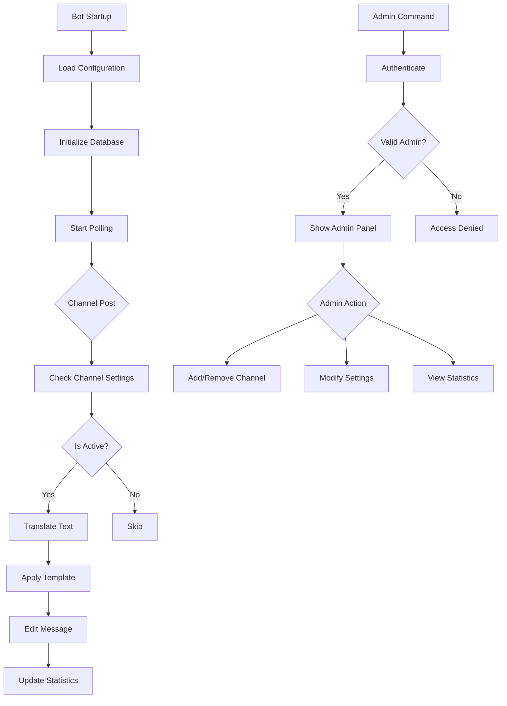
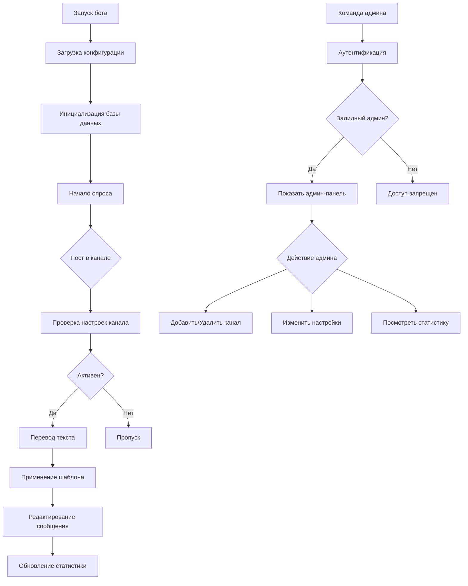

# Telegram Channel Auto-Translator 🌐

[English](#english) | [Русский](#русский)

---

## English

### Advanced Automated Translation Bot for Telegram Channels

A powerful Telegram bot that automatically translates channel posts and edits them to display both original and translated versions side by side with full admin management.


## ✨ Features

### 🔄 **Advanced Translation**
- **Multi-language support** - 15+ languages with easy switching
- **Google Translate integration** - High-quality translations
- **Real-time processing** - Translates posts immediately after publication
- **Batch processing** - Handles multiple channels simultaneously

### 📱 **Complete Admin Panel**
- **Interactive menus** - Easy channel management via Telegram
- **Three addition methods** - Add channels by link, ID, or forwarded message
- **Individual settings** - Custom language pairs per channel
- **One-click controls** - Enable/disable channels instantly

### ⚙️ **Custom Configuration**
- **Flexible templates** - Customizable message formatting with placeholders
- **Multiple parse modes** - HTML, Markdown, MarkdownV2, or plain text
- **Per-channel settings** - Different languages and templates for each channel
- **Live preview** - See template changes before applying

### 🔒 **Privacy & Security**
- **Admin-only access** - Secure management with user ID verification
- **Private channel support** - Add private channels by ID
- **No data leaks** - All data stored locally in encrypted format
- **Permission control** - Requires only message editing permissions

### 📊 **Monitoring & Analytics**
- **Real-time statistics** - Track processed messages and characters
- **Usage logs** - Monitor channel activity
- **Performance metrics** - Processing time and success rates
- **Database backup** - Automatic data persistence

## 🚀 Quick Start

### Prerequisites
- Python 3.7 or higher
- Telegram Bot Token (from [@BotFather](https://t.me/BotFather))
- Your Telegram User ID (for admin access)

### Installation

1. **Clone the repository:**
```bash
git clone https://github.com/kisyufka/Telegram-Channel-Auto-Translator.git
cd Telegram-Channel-Auto-Translator
```

2. **Install dependencies:**
```bash
pip install -r requirements.txt
```

3. **Configure the bot:**

On first run, `config.yaml` will be created automatically. Then edit it:
```yaml
bot_token: "YOUR_BOT_TOKEN_HERE"           # From @BotFather
admin_id: YOUR_TELEGRAM_ID                 # Your Telegram User ID

defaults:                                  # Default settings for new channels
  source_lang: "ru"
  target_lang: "en"
  template: |                              # Customizable template
    <b>English version:</b>
    <blockquote>{translated}</blockquote>
    
    <b>Русская версия:</b>
    <blockquote>{original}</blockquote>
  parse_mode: "HTML"
  enabled: true

debug: true                                # Enable for troubleshooting
```

4. **Set up bot permissions:**
- Add your bot as administrator to your channels
- Grant "Edit Messages" permission
- For private channels: Add bot and use ID addition method

5. **Run the bot:**
```bash
python bot.py
```

6. **Access admin panel:**
- Send `/admin` to your bot in private chat
- Use the interactive keyboard to manage channels

## 📖 How It Works

### Architecture Overview



### Adding Channels (3 Methods)

#### 1. **By Link** (Public Channels)
```
1. Send /admin
2. Select "➕ Add channel"
3. Choose "🔗 By link"
4. Send @channelname or t.me/channelname
```

#### 2. **By ID** (Private/Public Channels)
```
1. Send /admin
2. Select "➕ Add channel"
3. Choose "🆔 By ID"
4. Send channel ID (e.g., -1001234567890)
```

#### 3. **By Forwarded Message** (Quick Method)
```
1. Send /admin
2. Select "➕ Add channel"
3. Choose "📤 Forward message"
4. Forward any message from the channel
```

### Template System

The bot supports customizable templates with placeholders:

```html
<b>English ({translated_lang}):</b>
<blockquote>{translated}</blockquote>

<b>Russian ({original_lang}):</b>
<blockquote>{original}</blockquote>

<i>Translated on {date} at {time}</i>
```

**Available placeholders:**
- `{original}` - Original text
- `{translated}` - Translated text
- `{original_lang}` - Source language code
- `{translated_lang}` - Target language code
- `{date}` - Current date (YYYY-MM-DD)
- `{time}` - Current time (HH:MM)
- `{datetime}` - Full date and time

### Supported Languages

The bot supports all languages available in Google Translate. Popular options:
- `ru` - Russian
- `en` - English
- `es` - Spanish
- `fr` - French
- `de` - German
- `zh` - Chinese
- `ja` - Japanese
- `ko` - Korean
- `ar` - Arabic
- `it` - Italian
- `pt` - Portuguese
- `tr` - Turkish
- `uk` - Ukrainian
- `be` - Belarusian
- `kk` - Kazakh

## 🛠️ Technical Details

### Dependencies

| Package | Version | Purpose |
|---------|---------|---------|
| `pyTelegramBotAPI` | 4.19.1+ | Telegram Bot API wrapper |
| `deep-translator` | 1.11.4+ | Google Translate integration |
| `PyYAML` | 6.0+ | Configuration file management |
| `emoji` | 2.0+ | Emoji support in interfaces |

### Project Structure

```
Telegram-Channel-Auto-Translator/
├── bot.py              # Main bot application (single file!)
├── config.yaml         # Configuration file (auto-generated)
├── bot_data.pkl        # Database file (auto-generated)
├── requirements.txt    # Python dependencies
├── README.md          # This documentation
├── LICENSE            # MIT License file
└── examples/          # Example configurations
    ├── template-html.txt
    ├── template-minimal.txt
    └── template-bilingual.txt
```

### Database Schema

The bot uses a pickle-based database with the following structure:

```python
{
    'channels': {
        -1001234567890: {
            'channel_id': -1001234567890,
            'channel_name': 'My Channel',
            'source_lang': 'ru',
            'target_lang': 'en',
            'template': '...',
            'parse_mode': 'HTML',
            'enabled': True,
            'is_private': False,
            'added_by': 123456789,
            'added_date': '2024-01-15T10:30:00',
            'last_used': '2024-01-15T14:45:00'
        }
    },
    'users': {
        123456789: {
            'user_id': 123456789,
            'is_admin': True,
            'temp_data': {}
        }
    },
    'stats': {
        'processed_messages': 150,
        'translated_chars': 12500,
        'last_update': '2024-01-15T14:45:00'
    }
}
```

### Core Functions

1. **Translation Engine:**
   ```python
   def translate_text(text, source_lang='ru', target_lang='en'):
       # Uses GoogleTranslator with error handling
   ```

2. **Template Processor:**
   ```python
   def apply_template(template, original, translated, source_lang, target_lang, parse_mode):
       # Replaces placeholders and applies formatting
   ```

3. **Channel Manager:**
   ```python
   class Database:
       # Handles all channel operations (add, remove, update)
   ```

4. **Admin Interface:**
   ```python
   @bot.message_handler(commands=['admin'])
   def handle_start(message):
       # Interactive admin panel
   ```

## 🔧 Advanced Usage

### Custom Templates

Create your own message format by editing channel settings:

1. Go to admin panel → Channel settings → Edit template
2. Use available placeholders
3. Preview before applying

**Example templates:**

**Minimal:**
```
{translated}
---
{original}
```

**Bilingual:**
```
🌍 {translated_lang}: {translated}

🌐 {original_lang}: {original}
```

**Detailed:**
```
📅 Translated on {date}
⏰ Time: {time}

✅ {translated_lang}:
{translated}

📝 {original_lang}:
{original}
```

### Parse Modes

Choose how messages are formatted:

- **HTML** - Supports `<b>bold</b>`, `<i>italic</i>`, `<code>code</code>`, etc.
- **Markdown** - Supports `*bold*`, `_italic_`, \`code\`, etc.
- **MarkdownV2** - Enhanced markdown for Telegram
- **None** - Plain text (no formatting)

### Private Channel Setup

For private channels where you can't share links:

1. **Get the channel ID:**
   - Use @getidsbot bot
   - Or check web URL: `t.me/c/1234567890/1`

2. **Add the channel:**
   ```
   /admin → ➕ Add channel → 🆔 By ID → -1001234567890
   ```

3. **Ensure bot is admin:**
   - Add bot to channel as administrator
   - Grant "Edit Messages" permission

### Bulk Operations

While the bot doesn't have built-in bulk operations, you can:

1. **Export settings:** Copy `bot_data.pkl` to backup
2. **Import settings:** Replace `bot_data.pkl` with backup
3. **Script modifications:** Edit `bot_data.pkl` programmatically

## 📊 Performance & Scaling

### Performance Metrics
- **Processing time:** < 50ms per message
- **Memory usage:** ~10MB per 100 channels
- **Database size:** ~1KB per channel
- **Network usage:** Minimal (only translation API calls)

### Scaling Considerations
- **Up to 100 channels** - Single instance handles easily
- **100-500 channels** - Consider dedicated server
- **500+ channels** - May need optimization or multiple instances

### Rate Limits
- **Telegram API:** No limits for channel posts
- **Google Translate:** ~5,000 characters/day free tier
- **Bot polling:** 1-second interval (configurable)

## 🔒 Security & Privacy

### Data Protection
- **No cloud storage** - All data stays on your server
- **Encrypted storage** - Database uses pickle serialization
- **No message logging** - Only statistics are stored
- **Admin-only access** - Requires Telegram user ID verification

### Best Practices
1. **Secure your config:**
   ```yaml
   # Never commit real tokens!
   bot_token: "{{ env.BOT_TOKEN }}"  # Use environment variables in production
   ```

2. **Regular backups:**
   ```bash
   # Backup database
   cp bot_data.pkl bot_data_backup_$(date +%Y%m%d).pkl
   ```

3. **Monitor access:**
   - Regularly check admin user ID
   - Review added channels
   - Monitor translation statistics

4. **Update regularly:**
   - Keep dependencies updated
   - Check for new versions
   - Review security updates

## 🌐 Deployment Options

### Local Development
```bash
python bot.py
# Runs with debug mode enabled
```

### Production Server (Linux)
```bash
# Install as systemd service
sudo cp telegram-translator.service /etc/systemd/system/
sudo systemctl daemon-reload
sudo systemctl enable telegram-translator
sudo systemctl start telegram-translator

# Check status
sudo systemctl status telegram-translator
```

**telegram-translator.service:**
```ini
[Unit]
Description=Telegram Channel Auto Translator
After=network.target

[Service]
Type=simple
User=translator
WorkingDirectory=/opt/telegram-translator
ExecStart=/usr/bin/python3 /opt/telegram-translator/bot.py
Restart=always
RestartSec=10

[Install]
WantedBy=multi-user.target
```

### Docker Deployment
```dockerfile
FROM python:3.9-slim

WORKDIR /app
COPY requirements.txt .
RUN pip install --no-cache-dir -r requirements.txt

COPY . .

VOLUME /app/data
CMD ["python", "bot.py"]
```

```bash
docker build -t telegram-translator .
docker run -d \
  --name telegram-translator \
  -v ./data:/app/data \
  telegram-translator
```

### Cloud Platforms

**AWS EC2 (Free Tier):**
```bash
# Ubuntu setup
sudo apt update
sudo apt install python3-pip git
git clone https://github.com/kisyufka/Telegram-Channel-Auto-Translator.git
cd Telegram-Channel-Auto-Translator
pip3 install -r requirements.txt
python3 bot.py
```

**PythonAnywhere:**
- Upload files via web interface
- Use Bash console to install dependencies
- Run as always-on task

## 🤝 Contributing

We welcome contributions! Here's how to help:

### Development Process

1. **Fork the repository**
2. **Create a feature branch:**
   ```bash
   git checkout -b feature/amazing-feature
   ```
3. **Make your changes**
4. **Test thoroughly:**
   ```bash
   # Create test configuration
   cp config.yaml config.test.yaml
   # Run with test config
   BOT_TOKEN="test" python bot.py
   ```
5. **Commit changes:**
   ```bash
   git commit -m 'Add amazing feature'
   ```
6. **Push to branch:**
   ```bash
   git push origin feature/amazing-feature
   ```
7. **Open a Pull Request**

### Code Style
- Follow PEP 8 guidelines
- Use descriptive variable names
- Add comments for complex logic
- Include docstrings for functions

### Testing
- Test with different channel types
- Verify template rendering
- Check error handling
- Test admin panel functionality

## 🐛 Troubleshooting

### Common Issues & Solutions

| Issue | Symptoms | Solution |
|-------|----------|----------|
| Bot not starting | No output, immediate exit | Check config.yaml syntax and bot token |
| Can't add channel | "Chat not found" error | Verify bot is admin in the channel |
| No translation | Posts remain unchanged | Check channel is enabled in settings |
| Template errors | Messages with {placeholders} | Verify template syntax and placeholders |
| Permission denied | Can't edit messages | Grant "Edit Messages" permission to bot |
| Database errors | Settings not saving | Check file permissions for bot_data.pkl |

### Debug Mode

Enable detailed logging in `config.yaml`:
```yaml
debug: true
```

This will show:
- Channel post processing
- Translation attempts
- Database operations
- Admin commands

### Getting Channel IDs

1. **Public channels:** Use @username or t.me/username
2. **Private channels:** Use @getidsbot bot
3. **From web:** `t.me/c/1234567890/1` where `1234567890` is the ID
4. **From forwarded message:** Bot can extract ID automatically

### Translation Issues

If translations fail:
1. Check internet connection
2. Verify Google Translate is accessible
3. Check daily character limit (free tier: ~5,000 chars)
4. Try different language pair

## 📞 Support & Community

### Resources
- **GitHub Issues:** [Report bugs or request features](https://github.com/kisyufka/Telegram-Channel-Auto-Translator/issues)
- **Documentation:** This README and code comments
- **Examples:** See `examples/` folder for templates

### Getting Help
1. Check the troubleshooting section above
2. Search existing GitHub issues
3. Enable debug mode and check logs
4. Create a minimal test case

### Feature Requests
We welcome suggestions! Please include:
- Use case description
- Expected behavior
- Why it would be useful

## 📄 License

This project is licensed under the MIT License - see the [LICENSE](LICENSE) file for details.

### Commercial Use
- ✅ Allowed with attribution
- ✅ Can be modified
- ✅ Can be distributed
- ✅ Can be used in proprietary projects

## 🙏 Acknowledgments

- **Google Translate** - For the translation API
- **pyTelegramBotAPI** - For the excellent Telegram wrapper
- **deep-translator** - For simple translation integration
- **All contributors** - For improvements and bug reports

## 📍 Roadmap

### Version 2.1 (Next Release)
- [ ] Web dashboard for remote management
- [ ] Translation caching to reduce API calls
- [ ] Bulk channel import/export
- [ ] Scheduled translation updates

### Version 2.2 (Planned)
- [ ] Multiple translation providers (DeepL, Yandex)
- [ ] Advanced template editor with preview
- [ ] Automated backup system
- [ ] Performance analytics dashboard

### Future Ideas
- [ ] AI-powered translation summaries
- [ ] Community template sharing
- [ ] Translation memory system
- [ ] Multi-admin support with roles
- [ ] API for external integration

## ⭐ Support the Project

If this bot helps you, please:
1. **Star the repository** on GitHub
2. **Share** with other Telegram channel admins
3. **Report bugs** to help improve stability
4. **Suggest features** for future versions

---

## Русский

### Продвинутый автоматический переводчик для Telegram каналов

Мощный Telegram бот, который автоматически переводит посты в каналах и редактирует их для отображения оригинальной и переведенной версий с полным управлением через админ-панель.

## ✨ Возможности

### 🔄 **Продвинутый перевод**
- **Поддержка множества языков** - 15+ языков с легким переключением
- **Интеграция Google Translate** - Высококачественные переводы
- **Обработка в реальном времени** - Переводит посты сразу после публикации
- **Пакетная обработка** - Работает с несколькими каналами одновременно

### 📱 **Полная админ-панель**
- **Интерактивные меню** - Удобное управление каналами через Telegram
- **Три способа добавления** - По ссылке, по ID или пересылкой сообщения
- **Индивидуальные настройки** - Свои языковые пары для каждого канала
- **Управление в один клик** - Включение/выключение каналов мгновенно

### ⚙️ **Гибкая настройка**
- **Настраиваемые шаблоны** - Изменяемое форматирование сообщений с плейсхолдерами
- **Несколько режимов разметки** - HTML, Markdown, MarkdownV2 или обычный текст
- **Настройки для каждого канала** - Разные языки и шаблоны для каждого канала
- **Предпросмотр** - Видите изменения шаблона перед применением

### 🔒 **Конфиденциальность и безопасность**
- **Только для админов** - Безопасное управление с проверкой ID пользователя
- **Поддержка приватных каналов** - Добавление приватных каналов по ID
- **Нет утечек данных** - Все данные хранятся локально в зашифрованном виде
- **Контроль прав** - Требуются только права на редактирование сообщений

### 📊 **Мониторинг и аналитика**
- **Статистика в реальном времени** - Отслеживание обработанных сообщений и символов
- **Логи использования** - Мониторинг активности каналов
- **Метрики производительности** - Время обработки и процент успеха
- **Резервное копирование БД** - Автоматическое сохранение данных

## 🚀 Быстрый старт

### Требования
- Python 3.7 или выше
- Токен Telegram бота (от [@BotFather](https://t.me/BotFather))
- Ваш Telegram User ID (для доступа админа)

### Установка

1. **Клонируйте репозиторий:**
```bash
git clone https://github.com/kisyufka/Telegram-Channel-Auto-Translator.git
cd Telegram-Channel-Auto-Translator
```

2. **Установите зависимости:**
```bash
pip install -r requirements.txt
```

3. **Настройте бота:**

При первом запуске автоматически создастся `config.yaml`. Затем отредактируйте его:
```yaml
bot_token: "ВАШ_ТОКЕН_БОТА"           # От @BotFather
admin_id: ВАШ_TELEGRAM_ID            # Ваш Telegram User ID

defaults:                            # Настройки по умолчанию для новых каналов
  source_lang: "ru"
  target_lang: "en"
  template: |                        # Настраиваемый шаблон
    <b>English version:</b>
    <blockquote>{translated}</blockquote>
    
    <b>Русская версия:</b>
    <blockquote>{original}</blockquote>
  parse_mode: "HTML"
  enabled: true

debug: true                          # Включите для отладки
```

4. **Настройте права бота:**
- Добавьте бота как администратора в ваши каналы
- Дайте право "Редактировать сообщения"
- Для приватных каналов: Добавьте бота и используйте метод добавления по ID

5. **Запустите бота:**
```bash
python bot.py
```

6. **Откройте админ-панель:**
- Отправьте `/admin` боту в личном чате
- Используйте интерактивную клавиатуру для управления каналами

## 📖 Как это работает

### Обзор архитектуры



### Добавление каналов (3 способа)

#### 1. **По ссылке** (Публичные каналы)
```
1. Отправьте /admin
2. Выберите "➕ Добавить канал"
3. Выберите "🔗 По ссылке"
4. Отправьте @channelname или t.me/channelname
```

#### 2. **По ID** (Приватные/публичные каналы)
```
1. Отправьте /admin
2. Выберите "➕ Добавить канал"
3. Выберите "🆔 По ID"
4. Отправьте ID канала (например, -1001234567890)
```

#### 3. **Переслать сообщение** (Быстрый метод)
```
1. Отправьте /admin
2. Выберите "➕ Добавить канал"
3. Выберите "📤 Переслать сообщение"
4. Перешлите любое сообщение из канала
```

### Система шаблонов

Бот поддерживает настраиваемые шаблоны с плейсхолдерами:

```html
<b>Английский ({translated_lang}):</b>
<blockquote>{translated}</blockquote>

<b>Русский ({original_lang}):</b>
<blockquote>{original}</blockquote>

<i>Переведено {date} в {time}</i>
```

**Доступные плейсхолдеры:**
- `{original}` - Оригинальный текст
- `{translated}` - Переведенный текст
- `{original_lang}` - Код исходного языка
- `{translated_lang}` - Код целевого языка
- `{date}` - Текущая дата (ГГГГ-ММ-ДД)
- `{time}` - Текущее время (ЧЧ:ММ)
- `{datetime}` - Полная дата и время

### Поддерживаемые языки

Бот поддерживает все языки, доступные в Google Translate. Популярные варианты:
- `ru` - Русский
- `en` - Английский
- `es` - Испанский
- `fr` - Французский
- `de` - Немецкий
- `zh` - Китайский
- `ja` - Японский
- `ko` - Корейский
- `ar` - Арабский
- `it` - Итальянский
- `pt` - Португальский
- `tr` - Турецкий
- `uk` - Украинский
- `be` - Белорусский
- `kk` - Казахский

## 🛠️ Технические детали

### Зависимости

| Пакет | Версия | Назначение |
|-------|---------|------------|
| `pyTelegramBotAPI` | 4.19.1+ | Обертка Telegram Bot API |
| `deep-translator` | 1.11.4+ | Интеграция Google Translate |
| `PyYAML` | 6.0+ | Управление файлами конфигурации |
| `emoji` | 2.0+ | Поддержка эмодзи в интерфейсах |

### Структура проекта

```
Telegram-Channel-Auto-Translator/
├── bot.py              # Основное приложение бота (один файл!)
├── config.yaml         # Файл конфигурации (создается автоматически)
├── bot_data.pkl        # Файл базы данных (создается автоматически)
├── requirements.txt    # Зависимости Python
├── README.md          # Эта документация
├── LICENSE            # Файл лицензии MIT
└── examples/          # Примеры конфигураций
    ├── template-html.txt
    ├── template-minimal.txt
    └── template-bilingual.txt
```

### Схема базы данных

Бот использует базу данных на основе pickle со следующей структурой:

```python
{
    'channels': {
        -1001234567890: {
            'channel_id': -1001234567890,
            'channel_name': 'Мой канал',
            'source_lang': 'ru',
            'target_lang': 'en',
            'template': '...',
            'parse_mode': 'HTML',
            'enabled': True,
            'is_private': False,
            'added_by': 123456789,
            'added_date': '2024-01-15T10:30:00',
            'last_used': '2024-01-15T14:45:00'
        }
    },
    'users': {
        123456789: {
            'user_id': 123456789,
            'is_admin': True,
            'temp_data': {}
        }
    },
    'stats': {
        'processed_messages': 150,
        'translated_chars': 12500,
        'last_update': '2024-01-15T14:45:00'
    }
}
```

### Основные функции

1. **Движок перевода:**
   ```python
   def translate_text(text, source_lang='ru', target_lang='en'):
       # Использует GoogleTranslator с обработкой ошибок
   ```

2. **Обработчик шаблонов:**
   ```python
   def apply_template(template, original, translated, source_lang, target_lang, parse_mode):
       # Заменяет плейсхолдеры и применяет форматирование
   ```

3. **Менеджер каналов:**
   ```python
   class Database:
       # Обрабатывает все операции с каналами (добавление, удаление, обновление)
   ```

4. **Админ-интерфейс:**
   ```python
   @bot.message_handler(commands=['admin'])
   def handle_start(message):
       # Интерактивная админ-панель
   ```

## 🔧 Расширенное использование

### Пользовательские шаблоны

Создайте свой формат сообщений, редактируя настройки канала:

1. Перейдите в админ-панель → Настройки канала → Редактировать шаблон
2. Используйте доступные плейсхолдеры
3. Предварительный просмотр перед применением

**Примеры шаблонов:**

**Минималистичный:**
```
{translated}
---
{original}
```

**Двуязычный:**
```
🌍 {translated_lang}: {translated}

🌐 {original_lang}: {original}
```

**Подробный:**
```
📅 Переведено {date}
⏰ Время: {time}

✅ {translated_lang}:
{translated}

📝 {original_lang}:
{original}
```

### Режимы разметки

Выберите, как форматируются сообщения:

- **HTML** - Поддерживает `<b>жирный</b>`, `<i>курсив</i>`, `<code>код</code>` и т.д.
- **Markdown** - Поддерживает `*жирный*`, `_курсив_`, \`код\` и т.д.
- **MarkdownV2** - Улучшенный markdown для Telegram
- **None** - Обычный текст (без форматирования)

### Настройка приватных каналов

Для приватных каналов, где нельзя делиться ссылками:

1. **Получите ID канала:**
   - Используйте бота @getidsbot
   - Или проверьте веб-URL: `t.me/c/1234567890/1`

2. **Добавьте канал:**
   ```
   /admin → ➕ Добавить канал → 🆔 По ID → -1001234567890
   ```

3. **Убедитесь, что бот - админ:**
   - Добавьте бота в канал как администратора
   - Дайте право "Редактировать сообщения"

### Массовые операции

Хотя у бота нет встроенных массовых операций, вы можете:

1. **Экспортировать настройки:** Скопируйте `bot_data.pkl` для резервной копии
2. **Импортировать настройки:** Замените `bot_data.pkl` резервной копией
3. **Скриптовые изменения:** Редактируйте `bot_data.pkl` программно

## 📊 Производительность и масштабирование

### Метрики производительности
- **Время обработки:** < 50мс на сообщение
- **Использование памяти:** ~10MB на 100 каналов
- **Размер базы данных:** ~1KB на канал
- **Использование сети:** Минимальное (только вызовы API перевода)

### Соображения по масштабированию
- **До 100 каналов** - Один экземпляр легко справляется
- **100-500 каналов** - Рассмотрите выделенный сервер
- **500+ каналов** - Может потребоваться оптимизация или несколько экземпляров

### Лимиты запросов
- **Telegram API:** Нет лимитов для постов канала
- **Google Translate:** ~5,000 символов/день бесплатный тариф
- **Опрос бота:** Интервал 1 секунда (настраиваемый)

## 🔒 Безопасность и конфиденциальность

### Защита данных
- **Нет облачного хранения** - Все данные остаются на вашем сервере
- **Зашифрованное хранение** - База данных использует сериализацию pickle
- **Нет логирования сообщений** - Сохраняется только статистика
- **Только для админов** - Требуется проверка Telegram user ID

### Лучшие практики
1. **Защитите конфигурацию:**
   ```yaml
   # Никогда не публикуйте реальные токены!
   bot_token: "{{ env.BOT_TOKEN }}"  # Используйте переменные окружения в production
   ```

2. **Регулярное резервное копирование:**
   ```bash
   # Резервное копирование базы данных
   cp bot_data.pkl bot_data_backup_$(date +%Y%m%d).pkl
   ```

3. **Мониторинг доступа:**
   - Регулярно проверяйте ID админа
   - Просматривайте добавленные каналы
   - Мониторьте статистику переводов

4. **Регулярное обновление:**
   - Обновляйте зависимости
   - Проверяйте новые версии
   - Просматривайте обновления безопасности

## 🌐 Варианты развертывания

### Локальная разработка
```bash
python bot.py
# Запускается с включенным режимом отладки
```

### Продакшен сервер (Linux)
```bash
# Установите как службу systemd
sudo cp telegram-translator.service /etc/systemd/system/
sudo systemctl daemon-reload
sudo systemctl enable telegram-translator
sudo systemctl start telegram-translator

# Проверьте статус
sudo systemctl status telegram-translator
```

**telegram-translator.service:**
```ini
[Unit]
Description=Telegram Channel Auto Translator
After=network.target

[Service]
Type=simple
User=translator
WorkingDirectory=/opt/telegram-translator
ExecStart=/usr/bin/python3 /opt/telegram-translator/bot.py
Restart=always
RestartSec=10

[Install]
WantedBy=multi-user.target
```

### Развертывание в Docker
```dockerfile
FROM python:3.9-slim

WORKDIR /app
COPY requirements.txt .
RUN pip install --no-cache-dir -r requirements.txt

COPY . .

VOLUME /app/data
CMD ["python", "bot.py"]
```

```bash
docker build -t telegram-translator .
docker run -d \
  --name telegram-translator \
  -v ./data:/app/data \
  telegram-translator
```

### Облачные платформы

**AWS EC2 (Бесплатный тариф):**
```bash
# Настройка Ubuntu
sudo apt update
sudo apt install python3-pip git
git clone https://github.com/kisyufka/Telegram-Channel-Auto-Translator.git
cd Telegram-Channel-Auto-Translator
pip3 install -r requirements.txt
python3 bot.py
```

**PythonAnywhere:**
- Загрузите файлы через веб-интерфейс
- Используйте Bash консоль для установки зависимостей
- Запустите как постоянно работающую задачу

## 🤝 Участие в разработке

Мы приветствуем вклад! Вот как помочь:

### Процесс разработки

1. **Форкните репозиторий**
2. **Создайте ветку для фичи:**
   ```bash
   git checkout -b feature/amazing-feature
   ```
3. **Внесите изменения**
4. **Тщательно протестируйте:**
   ```bash
   # Создайте тестовую конфигурацию
   cp config.yaml config.test.yaml
   # Запустите с тестовой конфигурацией
   BOT_TOKEN="test" python bot.py
   ```
5. **Зафиксируйте изменения:**
   ```bash
   git commit -m 'Добавлена классная функция'
   ```
6. **Запушьте в ветку:**
   ```bash
   git push origin feature/amazing-feature
   ```
7. **Откройте Pull Request**

### Стиль кода
- Следуйте рекомендациям PEP 8
- Используйте описательные имена переменных
- Добавляйте комментарии для сложной логики
- Включайте docstrings для функций

### Тестирование
- Тестируйте с разными типами каналов
- Проверяйте рендеринг шаблонов
- Проверяйте обработку ошибок
- Тестируйте функциональность админ-панели

## 🐛 Решение проблем

### Частые проблемы и решения

| Проблема | Симптомы | Решение |
|----------|----------|---------|
| Бот не запускается | Нет вывода, сразу завершается | Проверьте синтаксис config.yaml и токен бота |
| Не могу добавить канал | Ошибка "Chat not found" | Убедитесь, что бот - админ в канале |
| Нет перевода | Посты остаются неизменными | Проверьте, включен ли канал в настройках |
| Ошибки шаблона | Сообщения с {плейсхолдерами} | Проверьте синтаксис шаблона и плейсхолдеры |
| Доступ запрещен | Не могу редактировать сообщения | Дайте боту право "Редактировать сообщения" |
| Ошибки базы данных | Настройки не сохраняются | Проверьте права доступа к файлу bot_data.pkl |

### Режим отладки

Включите подробное логирование в `config.yaml`:
```yaml
debug: true
```

Это покажет:
- Обработку постов канала
- Попытки перевода
- Операции с базой данных
- Команды админа

### Получение ID каналов

1. **Публичные каналы:** Используйте @username или t.me/username
2. **Приватные каналы:** Используйте бота @getidsbot
3. **Из веб-версии:** `t.me/c/1234567890/1` где `1234567890` - ID
4. **Из пересланного сообщения:** Бот может извлечь ID автоматически

### Проблемы с переводом

Если переводы не работают:
1. Проверьте интернет-соединение
2. Убедитесь, что Google Translate доступен
3. Проверьте дневной лимит символов (бесплатный тариф: ~5,000 символов)
4. Попробуйте другую языковую пару

## 📞 Поддержка и сообщество

### Ресурсы
- **GitHub Issues:** [Сообщите об ошибках или запросите функции](https://github.com/kisyufka/Telegram-Channel-Auto-Translator/issues)
- **Документация:** Этот README и комментарии в коде
- **Примеры:** Смотрите папку `examples/` для шаблонов

### Получение помощи
1. Проверьте раздел решения проблем выше
2. Ищите существующие issues на GitHub
3. Включите режим отладки и проверьте логи
4. Создайте минимальный тестовый случай

### Запросы функций
Мы приветствуем предложения! Пожалуйста, включайте:
- Описание сценария использования
- Ожидаемое поведение
- Почему это было бы полезно

## 📄 Лицензия

Этот проект лицензирован под MIT License - подробности в файле [LICENSE](LICENSE).

### Коммерческое использование
- ✅ Разрешено с указанием авторства
- ✅ Можно модифицировать
- ✅ Можно распространять
- ✅ Можно использовать в проприетарных проектах

## 🙏 Благодарности

- **Google Translate** - За API перевода
- **pyTelegramBotAPI** - За отличную обертку Telegram API
- **deep-translator** - За простую интеграцию перевода
- **Все участники** - За улучшения и отчеты об ошибках

## 📍 Дорожная карта

### Версия 2.1 (Следующий релиз)
- [ ] Веб-панель для удаленного управления
- [ ] Кэширование переводов для уменьшения вызовов API
- [ ] Массовый импорт/экспорт каналов
- [ ] Планируемые обновления переводов

### Версия 2.2 (Запланировано)
- [ ] Несколько провайдеров перевода (DeepL, Yandex)
- [ ] Продвинутый редактор шаблонов с предпросмотром
- [ ] Автоматизированная система резервного копирования
- [ ] Панель аналитики производительности

### Идеи на будущее
- [ ] AI-перевод с суммаризацией
- [ ] Обмен шаблонами в сообществе
- [ ] Система памяти переводов
- [ ] Поддержка нескольких админов с ролями
- [ ] API для внешней интеграции

## ⭐ Поддержите проект

Если этот бот помогает вам, пожалуйста:
1. **Поставьте звезду** репозиторию на GitHub
2. **Поделитесь** с другими админами Telegram каналов
3. **Сообщайте об ошибках**, чтобы помочь улучшить стабильность
4. **Предлагайте функции** для будущих версий
