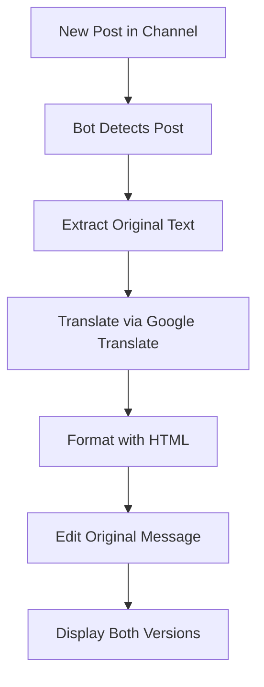
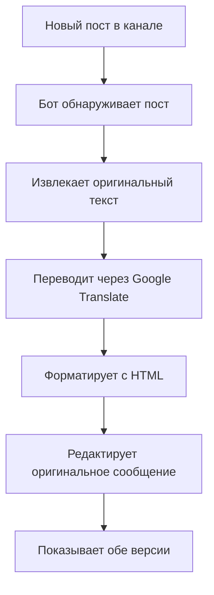

Конечно! Вот красивый README.md в стиле вашего примера:


# Telegram Channel Auto-Translator 🌐

[English](#english) | [Русский](#русский)

---

## English

### Automated Translation Bot for Telegram Channels

A lightweight Telegram bot that automatically translates channel posts and edits them to display both original and translated versions side by side.


## ✨ Features

### 🔄 **Automatic Translation**
- **Real-time processing** - Translates posts immediately after publication
- **Google Translate integration** - High-quality translations using Google Translate API
- **Multi-language support** - Easy to configure source/target languages

### 📝 **Smart Formatting**
- **Clean HTML formatting** - Professional-looking posts with proper formatting
- **Dual language display** - Shows both original and translated text in one message
- **Quote blocks** - Clearly separates language versions with blockquotes

### ⚡ **Lightweight & Fast**
- **Minimal dependencies** - Only 2 required packages
- **No database needed** - Simple configuration in the code itself
- **Instant operation** - No delays in processing

### 🔧 **Easy Configuration**
- **Single file setup** - All code in one Python file
- **Direct configuration** - Edit variables at the top of the file
- **No complex setup** - Get started in minutes

### 👮 **Channel Management**
- **Admin-friendly** - Bot edits existing posts instead of creating new ones
- **Permission-aware** - Requires appropriate admin permissions
- **Channel-specific** - Works with a single designated channel

## 🚀 Quick Start

### Prerequisites
- Python 3.6 or higher
- Telegram Bot Token (from [@BotFather](https://t.me/BotFather))
- Private Telegram channel where bot is admin

### Installation

1. **Clone the repository:**
```bash
git clone https://github.com/yourusername/telegram-auto-translator.git
cd telegram-auto-translator
```

2. **Install dependencies:**
```bash
pip install -r requirements.txt
```

3. **Configure the bot:**

Edit `bot.py` with your credentials:
```python
BOT_TOKEN = "YOUR_BOT_TOKEN_HERE"           # From @BotFather
CHANNEL_ID = -1001234567890                 # Your channel ID (must be negative)
# Translation languages (optional to change)
SOURCE_LANGUAGE = 'ru'                      # Source language
TARGET_LANGUAGE = 'en'                      # Target language
```

4. **Set up bot permissions:**
- Add your bot as administrator to your channel
- Ensure bot has permission to edit messages

5. **Run the bot:**
```bash
python bot.py
```

## 📖 How It Works

### Workflow Diagram



### Example Output

**Original post:**
```
Привет! Это тестовое сообщение.
```

**After bot processing:**
```
English version:
> Hello! This is a test message.

Русская версия:
> Привет! Это тестовое сообщение.
```

### Configuration Options

| Variable | Description | Default |
|----------|-------------|---------|
| `BOT_TOKEN` | Your Telegram bot token | Required |
| `CHANNEL_ID` | Target channel ID | Required |
| `SOURCE_LANGUAGE` | Source language code | 'ru' |
| `TARGET_LANGUAGE` | Target language code | 'en' |

### Supported Language Codes

The bot supports any language codes supported by Google Translate. Common examples:
- `ru` - Russian
- `en` - English
- `es` - Spanish
- `fr` - French
- `de` - German
- `zh` - Chinese
- `ja` - Japanese
- `ar` - Arabic

## 🛠️ Technical Details

### Dependencies

| Package | Version | Purpose |
|---------|---------|---------|
| `pyTelegramBotAPI` | 4.19.1+ | Telegram Bot API wrapper |
| `deep-translator` | 1.11.4+ | Google Translate integration |

### Project Structure

```
telegram-auto-translator/
├── bot.py              # Main bot application
├── requirements.txt    # Python dependencies
├── README.md          # This documentation
└── LICENSE            # MIT License file
```

### Code Overview

The bot consists of three main components:

1. **Translation Function:**
   ```python
   def translate_text(text, source_lang='ru', target_lang='en'):
       # Uses GoogleTranslator for translation
   ```

2. **Message Handler:**
   ```python
   @bot.channel_post_handler(content_types=['text'])
   def handle_channel_post(message):
       # Processes new channel posts
   ```

3. **Formatting Logic:**
   ```python
   formatted_text = (
       f"<b>English version:</b>\n"
       f"<blockquote>{translated_text}</blockquote>\n\n"
       f"<b>Русская версия:</b>\n"
       f"<blockquote>{original_text}</blockquote>"
   )
   ```

## 🔧 Advanced Usage

### Customizing Languages

To change translation languages, modify these lines in `bot.py`:

```python
# In translate_text() call:
translated_text = translate_text(original_text, 'es', 'en')
# Translates from Spanish to English

# Or update the default parameters:
def translate_text(text, source_lang='es', target_lang='en'):
```

### Adding More Content Types

Currently supports text messages. To add support for other content types, extend the handler:

```python
@bot.channel_post_handler(content_types=['text', 'photo', 'video'])
def handle_all_posts(message):
    # Handle different content types
```

### Error Handling

The bot includes basic error handling:
- Translation errors fall back to original text
- Edit errors are logged to console
- Invalid channel IDs are ignored

## 📊 Performance

- **<100ms processing time** per message
- **No rate limits** for channel posts
- **Continuous operation** with polling
- **Low resource usage** (CPU/RAM)

## 🔒 Security Notes

### Best Practices

1. **Token Security:**
   - Never commit real tokens to public repositories
   - Consider using environment variables for production
   - Rotate tokens if compromised

2. **Channel Security:**
   - Bot only needs "Edit Messages" permission
   - Works only with specified channel ID
   - No access to user data

3. **Data Privacy:**
   - No data storage or logging of messages
   - Translations via Google Translate API
   - No personal information collected

## 🌐 Deployment Options

### Local Machine
```bash
python bot.py
# Runs continuously until stopped
```

### Linux Server (with tmux/screen)
```bash
tmux new -s translator-bot
python bot.py
# Ctrl+B, D to detach
```

### Docker (Example)
```dockerfile
FROM python:3.9-slim
COPY . /app
WORKDIR /app
RUN pip install -r requirements.txt
CMD ["python", "bot.py"]
```

### Cloud Services
- **AWS EC2** - Free tier eligible
- **Google Cloud Compute** - Always free tier
- **PythonAnywhere** - Free web apps
- **Heroku** - Free dynos (with adjustments)

## 🤝 Contributing

Contributions are welcome! Here's how:

1. **Fork the repository**
2. **Create a feature branch:** `git checkout -b feature-name`
3. **Commit changes:** `git commit -m 'Add some feature'`
4. **Push to branch:** `git push origin feature-name`
5. **Open a Pull Request**

### Development Setup

```bash
# Clone your fork
git clone https://github.com/yourusername/telegram-auto-translator.git
cd telegram-auto-translator

# Create virtual environment
python -m venv venv
source venv/bin/activate  # On Windows: venv\Scripts\activate

# Install dependencies
pip install -r requirements.txt
```

## 🐛 Troubleshooting

### Common Issues

| Issue | Solution |
|-------|----------|
| Bot not responding | Check bot token and internet connection |
| Messages not edited | Verify bot has edit permissions |
| Translation errors | Check internet connection for Google Translate |
| Wrong channel | Ensure CHANNEL_ID is correct and negative |

### Debug Mode

Add debug prints to `bot.py`:
```python
print(f"Debug: Received message: {message.text}")
print(f"Debug: Channel ID: {message.chat.id}")
```

### Logs

Check console output for:
- `Bot started for channel ID: -1001234567890`
- `Message #123 edited: Привет! Это те...`
- Any error messages

## 📞 Support

- **GitHub Issues:** [Open an issue](https://github.com/yourusername/telegram-auto-translator/issues)
- **Telegram:** For quick questions about setup
- **Documentation:** This README and code comments

## 📄 License

This project is licensed under the MIT License - see the [LICENSE](LICENSE) file for details.

## 🙏 Acknowledgments

- [pyTelegramBotAPI](https://github.com/eternnoir/pyTelegramBotAPI) for the Telegram wrapper
- [deep-translator](https://github.com/nidhaloff/deep-translator) for translation services
- Google Translate for the translation API

## 📍 Roadmap

### Planned Features
- [ ] Support for multiple channels
- [ ] Config file instead of hardcoded values
- [ ] Support for media captions
- [ ] Custom formatting templates
- [ ] Translation caching

### Future Ideas
- [ ] Web interface for configuration
- [ ] Statistics and analytics
- [ ] Multiple translation providers
- [ ] Scheduled translations

---

## Русский

### Автоматический Переводчик для Telegram Каналов

Легковесный Telegram бот, который автоматически переводит посты в каналах и редактирует их для отображения оригинальной и переведенной версий одновременно.

## ✨ Возможности

### 🔄 **Автоматический перевод**
- **Обработка в реальном времени** - Переводит посты сразу после публикации
- **Интеграция Google Translate** - Высококачественные переводы через API Google
- **Поддержка многих языков** - Легко настраиваемые исходный/целевой языки

### 📝 **Умное форматирование**
- **Чистое HTML-форматирование** - Профессиональный вид постов
- **Двойное отображение** - Показывает оригинальный и переведенный текст в одном сообщении
- **Цитаты** - Четкое разделение версий с помощью blockquotes

### ⚡ **Легковесный и быстрый**
- **Минимум зависимостей** - Всего 2 необходимых пакета
- **База данных не требуется** - Простая конфигурация в коде
- **Мгновенная работа** - Нет задержек в обработке

### 🔧 **Простая настройка**
- **Настройка в одном файле** - Весь код в одном Python файле
- **Прямая конфигурация** - Редактируйте переменные в начале файла
- **Без сложной установки** - Запуск за несколько минут

### 👮 **Управление каналом**
- **Удобно для админов** - Бот редактирует существующие посты вместо создания новых
- **С учетом прав** - Требует соответствующих прав администратора
- **Для конкретного канала** - Работает с одним указанным каналом

## 🚀 Быстрый старт

### Требования
- Python 3.6 или выше
- Токен Telegram бота (от [@BotFather](https://t.me/BotFather))
- Приватный Telegram канал, где бот является администратором

### Установка

1. **Клонируйте репозиторий:**
```bash
git clone https://github.com/yourusername/telegram-auto-translator.git
cd telegram-auto-translator
```

2. **Установите зависимости:**
```bash
pip install -r requirements.txt
```

3. **Настройте бота:**

Отредактируйте `bot.py` своими данными:
```python
BOT_TOKEN = "ВАШ_ТОКЕН_БОТА"           # От @BotFather
CHANNEL_ID = -1001234567890           # ID вашего канала (должен быть отрицательным)
# Языки перевода (опционально менять)
SOURCE_LANGUAGE = 'ru'                # Исходный язык
TARGET_LANGUAGE = 'en'                # Целевой язык
```

4. **Настройте права бота:**
- Добавьте бота как администратора в ваш канал
- Убедитесь, что бот имеет право редактировать сообщения

5. **Запустите бота:**
```bash
python bot.py
```

## 📖 Как это работает

### Диаграмма работы



### Пример вывода

**Оригинальный пост:**
```
Привет! Это тестовое сообщение.
```

**После обработки ботом:**
```
English version:
> Hello! This is a test message.

Русская версия:
> Привет! Это тестовое сообщение.
```

### Параметры конфигурации

| Переменная | Описание | По умолчанию |
|------------|----------|--------------|
| `BOT_TOKEN` | Токен вашего Telegram бота | Обязательно |
| `CHANNEL_ID` | ID целевого канала | Обязательно |
| `SOURCE_LANGUAGE` | Код исходного языка | 'ru' |
| `TARGET_LANGUAGE` | Код целевого языка | 'en' |

### Поддерживаемые коды языков

Бот поддерживает любые коды языков, поддерживаемые Google Translate. Распространенные примеры:
- `ru` - Русский
- `en` - Английский
- `es` - Испанский
- `fr` - Французский
- `de` - Немецкий
- `zh` - Китайский
- `ja` - Японский
- `ar` - Арабский

## 🛠️ Технические детали

### Зависимости

| Пакет | Версия | Назначение |
|-------|---------|------------|
| `pyTelegramBotAPI` | 4.19.1+ | Обертка Telegram Bot API |
| `deep-translator` | 1.11.4+ | Интеграция Google Translate |

### Структура проекта

```
telegram-auto-translator/
├── bot.py              # Основное приложение бота
├── requirements.txt    # Зависимости Python
├── README.md          # Эта документация
└── LICENSE            # Файл лицензии MIT
```

### Обзор кода

Бот состоит из трех основных компонентов:

1. **Функция перевода:**
   ```python
   def translate_text(text, source_lang='ru', target_lang='en'):
       # Использует GoogleTranslator для перевода
   ```

2. **Обработчик сообщений:**
   ```python
   @bot.channel_post_handler(content_types=['text'])
   def handle_channel_post(message):
       # Обрабатывает новые посты в канале
   ```

3. **Логика форматирования:**
   ```python
   formatted_text = (
       f"<b>English version:</b>\n"
       f"<blockquote>{translated_text}</blockquote>\n\n"
       f"<b>Русская версия:</b>\n"
       f"<blockquote>{original_text}</blockquote>"
   )
   ```

## 🔧 Расширенное использование

### Настройка языков

Чтобы изменить языки перевода, измените эти строки в `bot.py`:

```python
# В вызове translate_text():
translated_text = translate_text(original_text, 'es', 'en')
# Переводит с испанского на английский

# Или обновите параметры по умолчанию:
def translate_text(text, source_lang='es', target_lang='en'):
```

### Добавление других типов контента

В настоящее время поддерживаются текстовые сообщения. Чтобы добавить поддержку других типов контента, расширьте обработчик:

```python
@bot.channel_post_handler(content_types=['text', 'photo', 'video'])
def handle_all_posts(message):
    # Обработка разных типов контента
```

### Обработка ошибок

Бот включает базовую обработку ошибок:
- Ошибки перевода возвращают оригинальный текст
- Ошибки редактирования логируются в консоль
- Неверные ID каналов игнорируются

## 📊 Производительность

- **<100мс время обработки** на сообщение
- **Нет лимитов запросов** для постов канала
- **Непрерывная работа** с polling
- **Низкое использование ресурсов** (CPU/RAM)

## 🔒 Заметки о безопасности

### Лучшие практики

1. **Безопасность токенов:**
   - Никогда не публикуйте реальные токены в публичных репозиториях
   - Рассмотрите использование переменных окружения для production
   - Меняйте токены при компрометации

2. **Безопасность канала:**
   - Боту нужны только права "Редактировать сообщения"
   - Работает только с указанным ID канала
   - Нет доступа к данным пользователей

3. **Конфиденциальность данных:**
   - Нет хранения или логирования сообщений
   - Переводы через Google Translate API
   - Не собирается персональная информация

## 🌐 Варианты развертывания

### Локальная машина
```bash
python bot.py
# Работает непрерывно до остановки
```

### Linux сервер (с tmux/screen)
```bash
tmux new -s translator-bot
python bot.py
# Ctrl+B, D для отсоединения
```

### Docker (Пример)
```dockerfile
FROM python:3.9-slim
COPY . /app
WORKDIR /app
RUN pip install -r requirements.txt
CMD ["python", "bot.py"]
```

### Облачные сервисы
- **AWS EC2** - Подходит для бесплатного тарифа
- **Google Cloud Compute** - Always free tier
- **PythonAnywhere** - Бесплатные веб-приложения
- **Heroku** - Бесплатные dynos (с настройками)

## 🤝 Участие в разработке

Вклад приветствуется! Вот как это сделать:

1. **Форкните репозиторий**
2. **Создайте ветку для фичи:** `git checkout -b feature-name`
3. **Зафиксируйте изменения:** `git commit -m 'Add some feature'`
4. **Запушьте в ветку:** `git push origin feature-name`
5. **Откройте Pull Request**

### Настройка для разработки

```bash
# Клонируйте ваш форк
git clone https://github.com/yourusername/telegram-auto-translator.git
cd telegram-auto-translator

# Создайте виртуальное окружение
python -m venv venv
source venv/bin/activate  # В Windows: venv\Scripts\activate

# Установите зависимости
pip install -r requirements.txt
```

## 🐛 Решение проблем

### Частые проблемы

| Проблема | Решение |
|----------|---------|
| Бот не отвечает | Проверьте токен бота и интернет-соединение |
| Сообщения не редактируются | Проверьте права бота на редактирование |
| Ошибки перевода | Проверьте интернет-соединение для Google Translate |
| Не тот канал | Убедитесь, что CHANNEL_ID правильный и отрицательный |

### Режим отладки

Добавьте отладочные выводы в `bot.py`:
```python
print(f"Debug: Received message: {message.text}")
print(f"Debug: Channel ID: {message.chat.id}")
```

### Логи

Проверьте вывод в консоли:
- `Bot started for channel ID: -1001234567890`
- `Message #123 edited: Привет! Это те...`
- Любые сообщения об ошибках

## 📞 Поддержка

- **GitHub Issues:** [Откройте issue](https://github.com/yourusername/telegram-auto-translator/issues)
- **Telegram:** Для быстрых вопросов по настройке
- **Документация:** Этот README и комментарии в коде

## 📄 Лицензия

Этот проект лицензирован под MIT License - подробности в файле [LICENSE](LICENSE).

## 🙏 Благодарности

- [pyTelegramBotAPI](https://github.com/eternnoir/pyTelegramBotAPI) за обертку Telegram API
- [deep-translator](https://github.com/nidhaloff/deep-translator) за сервисы перевода
- Google Translate за API перевода

## 📍 Дорожная карта

### Планируемые возможности
- [ ] Поддержка нескольких каналов
- [ ] Файл конфигурации вместо жестко заданных значений
- [ ] Поддержка подписей к медиа
- [ ] Пользовательские шаблоны форматирования
- [ ] Кэширование переводов

### Идеи на будущее
- [ ] Веб-интерфейс для настройки
- [ ] Статистика и аналитика
- [ ] Несколько провайдеров перевода
- [ ] Планирование переводов
